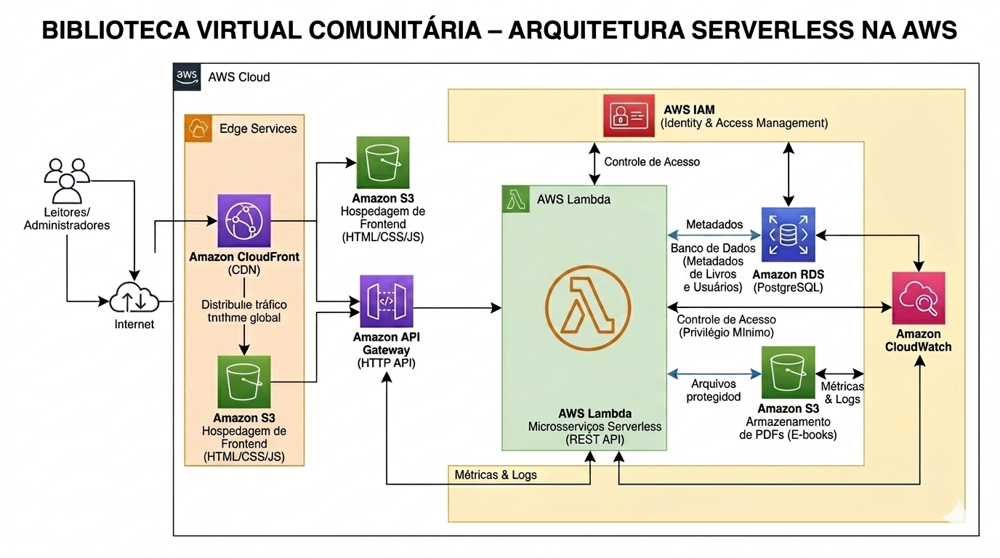
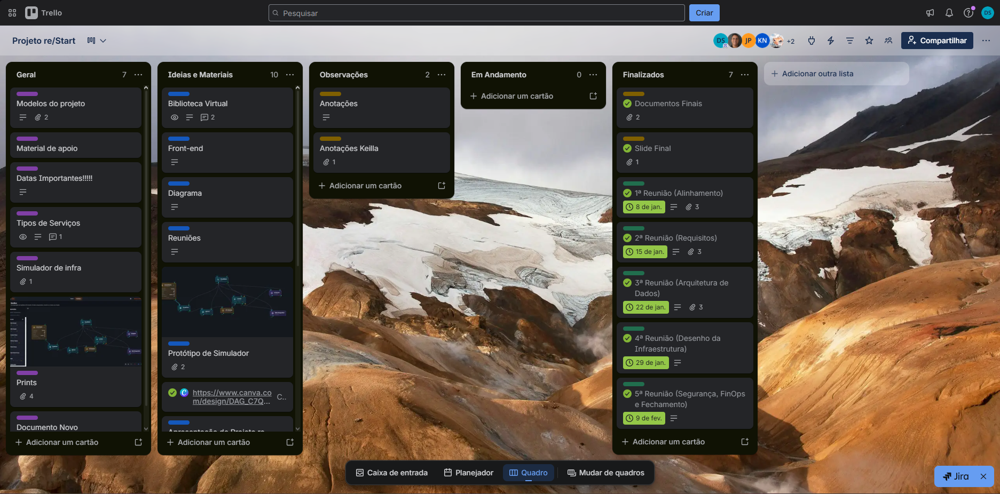

# Biblioteca Virtual Comunitária — Arquitetura Serverless na AWS

## Sobre o Projeto
Este projeto consiste no planejamento ágil, levantamento de requisitos e desenho arquitetural de uma plataforma social em nuvem voltada à democratização do acesso à leitura e inclusão digital. A solução foi desenhada para funcionar como um Produto Mínimo Viável (MVP) de alta disponibilidade, escalabilidade automática e baixo custo operacional.

> **Nota:** Este é um projeto de concepção arquitetural e design técnico teórico desenvolvido como trabalho de conclusão de curso para a **Escola da Nuvem**.

---

## Objetivos do Negócio & Alinhamento ODS
* **Inclusão Social:** Permitir que estudantes e comunidades periféricas acessem livros e materiais pedagógicos gratuitamente.
* **Sustentabilidade Cultural:** Apoiar autores independentes oferecendo um espaço descentralizado para publicação.
* **Alinhamento com as ODS da ONU:** Contribuição direta com a **ODS 4 (Educação de Qualidade)** e **ODS 10 (Redução das Desigualdades)**.

---

## Arquitetura da Solução (AWS)

A infraestrutura foi projetada seguindo o modelo **Serverless** (computação sob demanda), minimizando custos ociosos e garantindo que a plataforma aguente picos de acessos sem necessidade de intervenção manual.

### Componentes da Infraestrutura:
* **Hospedagem & Distribuição (Frontend):** O frontend estático é hospedado de forma segura no **Amazon S3** e distribuído globalmente através do **Amazon CloudFront**, garantindo baixa latência e cache eficiente.
* **Camada de Computação (Backend):** Toda a lógica de negócios (catálogo, buscas, downloads) foi projetada em funções **AWS Lambda** utilizando o runtime **Python 3.x**.
* **Exposição de APIs:** O **Amazon API Gateway** gerencia as rotas HTTP, servindo como a porta de entrada segura para as requisições do cliente até as funções Lambda.
* **Persistência de Dados & Arquivos:**
  * **Amazon RDS (PostgreSQL):** Armazenamento estruturado e relacional para metadados de livros, usuários e registros de downloads.
  * **Amazon S3 (Buckets Protegidos):** Repositório dedicado para o armazenamento dos arquivos físicos (PDFs) dos livros com políticas de acesso restritas.
* **Segurança e Governança:**
  * **AWS IAM:** Controle estrito de acessos baseado no princípio do privilégio mínimo para a comunicação entre os serviços (ex: Lambda acessando o RDS/S3).
  * Conformidade conceitual com as diretrizes da **LGPD** para proteção de dados dos usuários.
* **Observabilidade:**
  * **Amazon CloudWatch:** Configurado conceitualmente para retenção de logs das Lambdas, métricas de erros e alarmes de latência do API Gateway.

---

## 📊 Planejamento Ágil & Metodologia
O ciclo de vida do projeto foi gerenciado utilizando a metodologia Kanban por meio do Trello, onde as entregas e evoluções do MVP foram estruturadas em marcos semanais de desenvolvimento e validação técnica:

* **08/jan. — 1ª Reunião (Alinhamento):** Kick-off do projeto, definição do escopo da Biblioteca Virtual e divisão de papéis da equipe.
* **15/jan. — 2ª Reunião (Requisitos):** Levantamento detalhado de requisitos funcionais, não funcionais e mapeamento de conformidade com a LGPD.
* **22/jan. — 3ª Reunião (Arquitetura de Dados):** Modelagem conceitual do banco de dados relacional e planejamento das tabelas no Amazon RDS.
* **29/jan. — 4ª Reunião (Desenho da Infraestrutura):** Elaboração do diagrama de arquitetura serverless englobando API Gateway, AWS Lambda e Amazon S3.
* **09/fev. — 5ª Reunião (Segurança, FinOps e Fechamento):** Definição de políticas IAM de privilégio mínimo, orçamento no AWS Budgets e consolidação dos entregáveis finais.

---

## Análise de Custos & FinOps (Estimativa Mensal)
Utilizando ferramentas como o **AWS Budgets** e o **AWS Cost Explorer**, foi desenhado um teto de gastos aproveitando ao máximo as capacidades do *Free Tier* da AWS.

| Serviço AWS | Custo Mensal Estimado (USD) | Abordagem de Economia |
| :--- | :---: | :--- |
| **Amazon RDS (PostgreSQL)** | \$27.96 | Dimensionado na menor instância viável para o MVP |
| **Amazon VPC** | \$3.65 | Restrito ao tráfego isolado necessário para o banco de dados |
| **Amazon CloudWatch** | \$0.60 | Configuração de retenção de logs e métricas |
| **Amazon CloudFront** | \$0.11 | Cache na ponta para diminuir requisições ao S3 |
| **Amazon API Gateway** | \$0.02 | Cobrança estritamente sob demanda por volume de chamadas |
| **AWS Lambda** | \$0.00 | Coberto integralmente pelas camadas gratuitas |
| **Total Estimado** | **\$32.34 / mês** | Solução para um ambiente inicial |

---

## Competências Desenvolvidas
* Computação em Nuvem (Cloud Computing)
* Arquitetura Serverless (AWS Lambda & API Gateway)
* Arquitetura de Banco de Dados (Amazon RDS)
* Metodologias Ágeis no Desenvolvimento de Aplicações
* Práticas de FinOps & Otimização de Custos em Nuvem
* Governança e Segurança (AWS IAM & LGPD)

---
## Integrantes do Grupo
* <a href="https://www.linkedin.com/in/lucasodrelkd/">Lucas Araujo Sodré</a>
* <a href="https://www.linkedin.com/in/demethrius-heitor">Deméthrius Heitor Silva de Santana</a>
* <a href="https://www.linkedin.com/in/edmarfreitas/">Edmar de Freitas Nascimento da Rocha Alves</a>
* <a href="https://www.linkedin.com/in/keilla-cristina-nascimento/">Keilla Cristina Nascimento Couto</a>
* <a href="https://www.linkedin.com/in/josimar-bitencourt-pereira/">Josimar Bitencourt Pereira</a>
* <a href="https://www.linkedin.com/in/luiz-henrique-gomes-pozenatto/">Luiz Henrique Gomes Pozenatto</a>